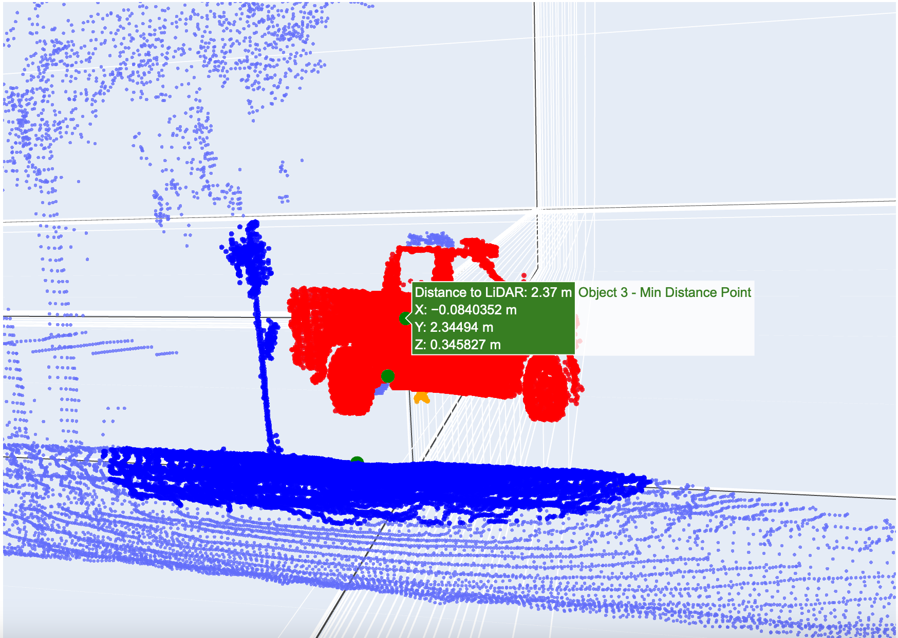
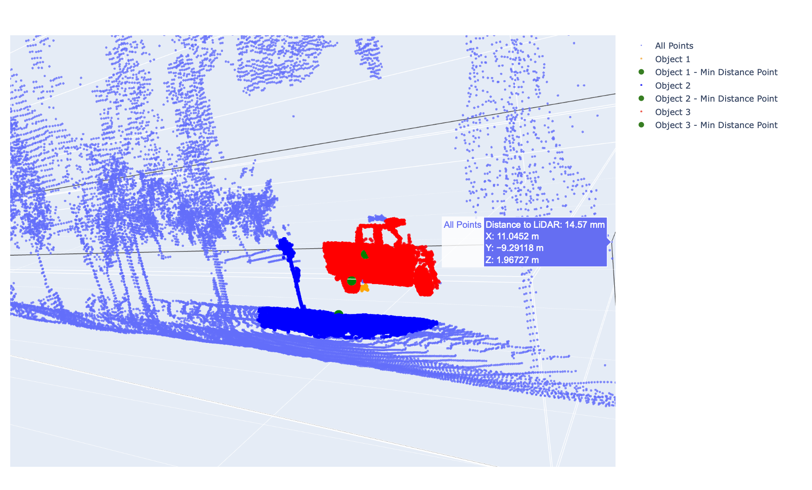

# Distance-estimation-of-passing-vehicles-and-object-segmentation-using-DBSCAN
### Overview
- This repository contains Python scripts designed to process LiDAR point cloud data recorded on a bicycle, and extract the minimum passing distance of vehicles.
- The scripts perform object segmentation using DBSCAN clustering, and identify cars within a specified distance threshold (maximum distance from the bike to look for passing cars). 

  

### How to Use

#### Prerequisites
- Ensure you have Python installed. The code was tested with Python 3.10
- Install the required libraries:
This code was tested with pandas 2.0.3, numpy 1.24.3, scikit-learn 1.3.0, scipy 1.11.1, plotly 5.9.0
- (#in order to run this script, the data should be in CSV format that includes the X, Y and Z coordinates of each point (in our case we used ouster))Data frames used are in the form of CSV files saved through [Ouster Studio](https://ouster.com/products/software/ouster-studio) software. A sample dataframe will look as such:

| Timestamp      | Reflectivity | Range | NIR  | Signal | Point:0 | Point:1 | Point:2 |
|----------------|--------------|-------|------|--------|---------|---------|---------|
| 836424652552   | 0            | 0     | 1954 | 10     | 0.0     | 0.0     | 0.0     |
| 836425438504   | 0            | 0     | 4169 | 20     | 0.0     | 0.0     | 0.0     |
| 836326323152   | 0            | 0     | 5232 | 23     | 0.0     | 0.0     | 0.0     |
| 836327109104   | 0            | 0     | 4909 | 17     | 0.0     | 0.0     | 0.0     |
| 836424652552   | 0            | 0     | 1338 | 6      | 0.0     | 0.0     | 0.0     |

*Point:0*, *Point:1* and *Point:2* represent the X, Y and Z coordinates of the points, respectively. In your data these coordinates might have different headers in the dataframe, so make sure you change the names of these columns in the script or rename your columns accordingly. 

#### Instructions
1. **Clone/fork this repository**

2. **Install Required Libraries**:

     - Ensure you have the required libraries installed. 

3. **Include your CSV data file**:
    - Export a CSV file that includes a frame of interest (in this case, with a passing car) from your pointcloud data. In our case, we used Ouster Studio to export the CSV file
    - Place the CSV file in the **data** folder
    - Change the data file path and name(`data_file_path`) in main.py to point to the directory of your data file

4. **Change the output file name**:
    - Change the output file path (`output_file_path`) as well. The code will generate an output CSV file for every frame you run, so make sure to change the name of the output file every time you include a different frame. 
    - This file will include points and their coordinates, with every point's distance to the LiDAR, and the `object_ID` which is the ID assigned to each point by the DBSCAN clustering. It is used to compute the minimum distance.

5. **Check your columns' header names**:
    - Check the names of the columns that represent the coordinates of the points, if they are different than as shown in the above table, you can rename the columns in your dataframes to *Point:0*, *Point:1* and *Point:2*, or change the variables' names of these coordinates in each file to match your dataframe.

6. **Execute the code**:

    - Open your terminal or command prompt. Or you can use any terminal on a python environment (like Jupyter)
    - Navigate to this directory
    - Run the code by executing the main.py file:
    `python main.py`

6. **Check output**:
    
    - If successful, the code will perform the operations outlined in the function and display the minimum passing distance at the output of the terminal or command prompt, and the visualization (3d scatter plot) will automatically open in your default browser. The plot is interactive and it will look as such:
      

      
      

    - The script saves labeled objects and their distances to a CSV file specified by `output_file_path`.

#### Possible Adjustments

- You might want to modify parameters and thresholds according to your dataset and requirements. Steps like adjusting DBSCAN parameters (`eps` and `min_samples`), or setting Z threshold (`z_threshold`) which is set to get rid of noise on the ground level, are optional or you can use the default values set in the code.
- If you are using a sensor with a different resolution you might need to change these parameters. In our case, we tested the scripts on a lower resolution sensor data, and these parameters worked fine, however if you have a higher resolution (more than 128-channel) some adjustment might be needed

#### How the algorithm works

The functions in the scripts perform the following steps:
1. Read the LiDAR point cloud data from a CSV file.
2. Remove points below a specified Z threshold, this ensures that noise points on the ground level are excluded to have cleaner clusters.
3. Perform DBSCAN clustering on the remaining points.
4. Calculate distances between the LiDAR and segmented objects.
5. Identifie cars within the specified distance threshold, which ensures the maximum distance to look for passing cars on the left of the LiDAR position.
6. Generate a 3D scatter plot visualizing the point cloud data and identified objects.

### Notes

- The parameters set in this script are defined after manual tuning. Several combinations of *epsilon* and *minimum points* (DBSCAN parameters) were tested to reach the best values that align with the data in hand.  
- The LiDAR sensor used in this project is the Ouster OS1 128-channel. You might have a lower resolution sensor which generates less number of points or a higher resolution one, so you need to check the result of the clustering on your data, if you can't identify defined clusters, parameter tuning is required, such as `eps`, `min_samples` and `distance_threshold` in main.py, to suit your data. 

### References

- [Pandas Documentation](https://pandas.pydata.org/pandas-docs/stable/index.html)
- [Scikit-learn Documentation](https://scikit-learn.org/stable/documentation.html)
- [Scipy Documentation](https://docs.scipy.org/doc/)
- [Plotly Documentation](https://plotly.com/python/)
- [Ouster Studio](https://ouster.com/products/software/ouster-studio)

